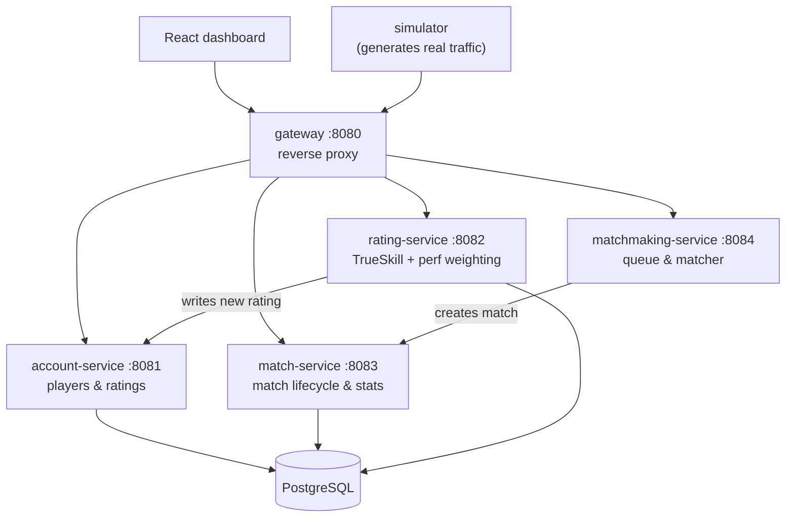

# Valorant Matchmaking & Ranking System

A backend that queues players, forms balanced 5v5 matches, and ranks players
afterward with TrueSkill, built as four independent Go services talking over HTTP,
sitting behind a small reverse-proxy gateway, backed by Postgres.

## Stack

- **Go 1.27** - all four services and the CLI tools
- **PostgreSQL 18**, accessed via **pgx/v5** (no ORM)
- **chi** - HTTP routing
- **ChrisHines/GoSkills** - the actual TrueSkill implementation (a Go port of Jeff
  Moser's widely-used C# reference)
- **testcontainers-go** - every database test runs against a real, disposable
  Postgres container, not a mock or a shared dev database
- **Docker Compose** - local orchestration for all services + Postgres
- **GitHub Actions** - CI, including the containerized DB tests, on every push
- **React 19 + Vite + Tailwind + shadcn/ui + TanStack Query** - a live dashboard,
  talking to the gateway

## Architecture



Each service owns one part of the schema and never reaches into another service's
tables. `rating-service`, for example, computes new ratings but calls
`account-service`'s API to actually write them: it has no DB credentials for the
`players` table at all. The one deliberate exception is `rating_history`: it's written
directly by `rating-service`, because it's the only writer and only reader of that
table, and putting a whole extra service in front of a table nobody else touches would
be ceremony, not architecture.

## What each service does

- **account-service** - player identity and current rating (`mu`, `sigma`).
- **rating-service** - runs TrueSkill on a completed match's win/loss result, then
  applies a bounded performance-score adjustment on top (see below), and persists
  both the new rating and a full history row.
- **match-service** - owns match creation and stat submission; the only service that
  writes to `matches` and `match_participants`.
- **matchmaking-service** - the actual queue and matchmaking loop. This is the part
  I spent the most time on.
- **gateway** - the only thing the browser ever talks to. A thin reverse proxy in
  front of the four services above, so the frontend doesn't need to know four
  different hostnames or handle CORS four separate times.
- **simulator** - a standalone Go program that calls the real public APIs
  continuously: creates players, queues them, waits for matches to form, submits
  randomized stats, and pushes them through rating-service. It's how the dashboard has
  something to show without me manually curling ten players in by hand.

## The matchmaking algorithm

1. A player joins the queue with a conservative rating estimate (`mu - 3σ`),
   deliberately pessimistic, so a player TrueSkill is still unsure about doesn't get
   ranked as if the system were certain.
2. A single goroutine owns the entire queue. Nothing else is allowed to touch it
   directly: every add, remove, or read goes through a channel. This is the "actor"
   pattern: instead of a mutex guarding shared state, exactly one goroutine holds the
   state and everyone else sends it messages. I checked this with Go's race detector
   under concurrent load rather than just trusting the reasoning.
3. A separate ticker scans the queue for 10 players close enough in rating. The
   acceptable gap widens the longer someone's been waiting, but never past what a
   player who *just* joined would tolerate, so patience doesn't get someone dumped
   into a wildly unfair game.
4. Once 10 are found, every possible 5v5 split is checked (only 252 of them for 10
   players, so brute force is fine) and the split with the closest team averages wins.
5. Those 10 players come off the queue atomically before the match gets created
   downstream. If that downstream call fails, they go back in, with their original
   wait time, not reset to zero, so they don't lose the patience they'd already earned.

## The rating algorithm

TrueSkill runs on win/loss/draw alone, the way it's meant to be used. I didn't touch
its internals. Kills, deaths, and assists don't go into TrueSkill directly, because
that would just reward racking up kills in a lopsided game over actually winning it.
Instead: I compute a performance score per player, normalize it against that player's
own team's average (so a stomp doesn't inflate one side's numbers relative to the
other), clamp the result to a sane range, and use it to scale how much of the TrueSkill
rating change that specific player receives. A standout player on the winning team
gains more than a teammate who did less; sigma is left exactly as TrueSkill computed
it, since one match's stat line isn't a good reason to override what the algorithm
itself believes about its own certainty.

## Running it

Requirements: Docker and Docker Compose. Node.js if you want the dashboard.

```bash
git clone https://github.com/me-harshil/valorant-matchmaking.git
cd valorant-matchmaking
cp .env.example .env      # set POSTGRES_PASSWORD
docker compose up --build
```

Database migrations run automatically the first time Postgres starts. Once all five
containers are up:

```bash
# generates continuous simulated matches so there's something to watch
go run ./cmd/simulator

# the dashboard, in a second terminal
cd web
npm install
npm run dev   # http://localhost:5173
```

Run the test suite (spins up real, throwaway Postgres containers per test, no setup
required beyond Docker):

```bash
go test ./... -race
```